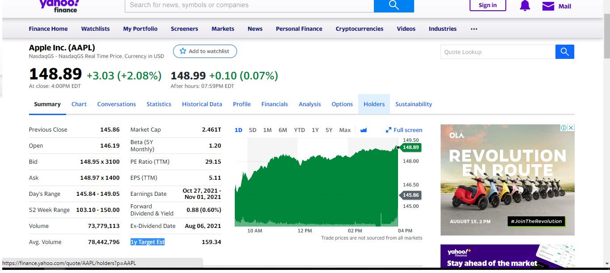

# PROJECT WEBSCRAPING YAHOO FINANCE
Small project to extract economic metrics of Apple using a python framework Scrapy.

1. Create a spider and set up url  

2. Through xpath get item in response(url)  

3. Prepare items to export. 

4. Export to csv file  

